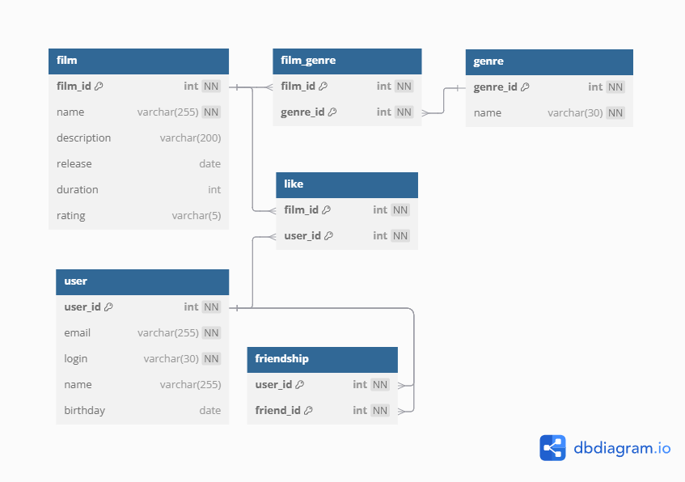

# Описание базы данных



## Таблицы
 **film** - информация о фильмах.
* _film_id_, int, NOT NULL - primary key
* _name_, varchar(255), NOT NULL - название фильма
* _description_, varchar(200) - описание фильма
* _release_, date - дата выхода фильма
* _duration_, int - продолжительность фильма в минутах
* _rating_, varchar(5) - возрастной рейтинг Американской киноассоциации (MPAA)

 **genre** - информация о жанрах фильмов.
* _genre_id_, int, NOT NULL - primary key
* _name_, varchar(30), NOT NULL - название жанра

 **film_genre** - соединительная таблица, для связи таблиц film и genre. У одного фильма может быть несколько жанров.
* _film_id_, int, NOT NULL - составной первичный ключ, внешний ключ (ссылается на film.film_id)
* _genre_id_, int, NOT NULL - составной первичный ключ, внешний ключ (ссылается на genre.genre_id)

 **user** - информация о пользователях.
* _user_id_, int, NOT NULL - primary key
* _email_, varchar(255), NOT NULL - электронная почта
* _login_, varchar(30), NOT NULL - логин
* _name_, varchar(255) - имя
* _birthday_, date - дата рождения

 **friendship** - дружественные связи пользователей.
* _user_id_, int, NOT NULL - составной первичный ключ, внешний ключ (ссылается на user.user_id)
* _friend_id_, int, NOT NULL - составной первичный ключ, внешний ключ (ссылается на user.user_id)
  
  Пояснение:
  user id = 1 отправляет запрос на дружбу пользователю user id = 2 - добавляем в таблицу строку: |1| |2|.
  После того как user id = 2 подтверждает дружбу - добавляем в таблицу ещё 1 строку: |2| |1|.

 **like** - проставленные лайки к фильмам.
* _film_id_, int, NOT NULL - составной первичный ключ, внешний ключ (ссылается на film.film_id)
* _user_id_, int, NOT NULL - составной первичный ключ, внешний ключ (ссылается на user.user_id)

## Примеры запросов
- Получение всех фильмов
```dbn-psql
SELECT * FROM film;
```
- Список фильмов по жанру
```dbn-psql
SELECT f.name FROM film AS f
WHERE f.film_id IN (
    SELECT fg.film_id
    FROM film_genre AS fg INNER JOIN genre AS g ON fg.genre_id = g.genre_id
    WHERE g.name = 'Название жанра'
);
```

- Количество лайков у фильма
```dbn-psql
SELECT COUNT(user_id) FROM like WHERE film_id = 1;
```

- Получение N самых популярных фильмов
```dbn-psql
SELECT f.name FROM film AS f WHERE f.film_id IN (
    SELECT l.film_id FROM like AS l
    GROUP BY l.film_id
    ORDER BY COUNT(l.user_id) DESC
    LIMIT N);
```

- Получение всех пользователей
```dbn-psql
SELECT * FROM user;
```

- Список друзей пользователя (подтверждённые и неподтвержденные)
```dbn-psql
SELECT friend_id FROM friendship
WHERE user_id = 1;
```

- Список подтверждённых друзей пользователя id = 1
```dbn-psql
SELECT friend_id FROM friendship
WHERE user_id = 1 
AND friend_id IN (
  SELECT user_id FROM friendship
  WHERE friend_id = 1);
```

- Список неподтверждённых друзей
```dbn-psql
SELECT friend_id FROM friendship
WHERE user_id = 1
AND friend_id NOT IN (
  SELECT user_id FROM friendship
  WHERE friend_id = 1);
```
